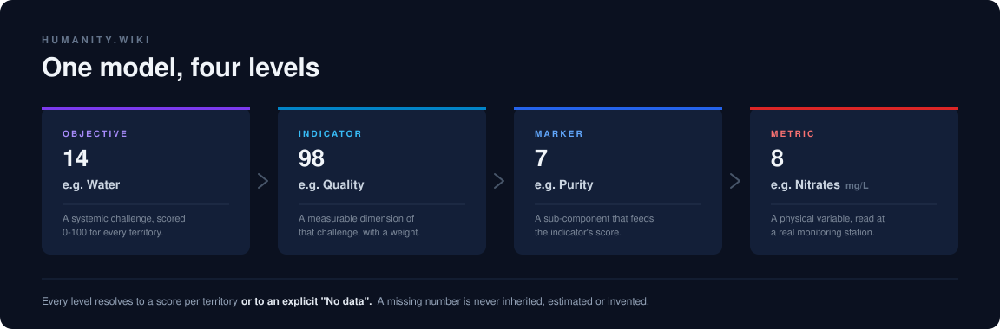

# 🌍 humanity.wiki

<div align="center">

### An honest map of the planet's systemic challenges: knowledge graphs, territories and indicators, from the whole world down to a single river gauge

[](https://humanity.wiki)
[](https://react.dev)
[](https://postgis.net)
[](#-how-this-repo-is-built)

</div>

## 🧭 What It Is

Data about the things that actually matter (the state of our water, our food, our housing, our ecosystems) is scattered across PDFs, ministries and one-off reports. When you do find it, it stops at the national level, and you can rarely tell where a number came from.

**humanity.wiki** puts that knowledge into one navigable model. Pick a challenge, zoom from the planet to a municipality, and keep drilling until you reach the physical station that produced the reading. Every number carries its source and its date, and **when there is no data, the platform says so** instead of shading in a plausible guess.

## 🔭 Three Ways In

The same knowledge, told three ways. Each door is a live window on the homepage: not a screenshot, the actual page running inside it.

| Door | The idea | What you get |
|---|---|---|
| 🗄 **Database** | The raw data | All 92 tables that hold the platform up, open for inspection. No presentation layer, just the truth exactly as it is stored. |
| 🕸 **Network of Data** | The knowledge, connected | Each topic is a sphere. Zoom in and its posts unfold; the lines tell you whether something is a cause, a piece of evidence or a solution, and the thicker the current, the more alive that topic is right now. |
| 🗺 **Geolocation of Data** | The knowledge, on the ground | Where each thing happens: 242 territories, 98 indicators and physical measurements on a real map, from the planet down to the municipality. |

## 📐 One Model, Four Levels



Every entity in the platform hangs off this spine, and it is what makes the drill-down possible. A single chain, end to end:

```
Water                       OBJECTIVE   how far a territory is from solving it
    └── Quality             INDICATOR   a measurable dimension of that challenge
        └── Purity          MARKER      a sub-component of the indicator's score
            └── Nitrates    METRIC      mg/L, read at a physical station
                └── Río Ebro – Flix · Río Tajo – Aranjuez · Río Duero – Valladolid
                    …15 real gauges across Spain, each with source and date
```

Adding a new challenge, country or pollutant means adding rows, not changing the structure.

## 📊 What Is Measured and What Is Scaffolding

This is the part most projects leave out. The platform's first principle is **never fabricate data**, so here is exactly where it stands today:

| Data | Status |
|---|---|
| Water indicators for Spain and its 17 regions | ✅ **Real**, from cited sources |
| The `Purity` marker across 17 regions | ✅ **Real** |
| 8 water contaminant metrics · 15 river stations · 120 readings | ✅ **Real**, from an official monitoring report |
| 242 territories (planet → continent → country → region → municipality) | ✅ **Real** geography |
| Objective-level scores (0-100) | ⚠️ Computed in memory from seed data, not yet from stored observations |
| 179 Madrid municipalities | ⚠️ Real territories, **simulated** scores |
| 32 European countries | ⚠️ Real geography, **placeholder** scores |
| The 8 objectives added in 2026 (Education, Energy, Employment…) | 🏗 Structure only, no observations yet, so they render as *"No data"* |

Territories with no data for the active level are painted grey and labelled *"No data"*. They never inherit a score from the level above.

## 🛠 Stack

- **Frontend**: React 19 · TypeScript · Vite 6 · Tailwind CSS 4 · React Router 7
- **Maps**: Mapbox GL JS, with vector tiles generated inside Postgres via `ST_AsMVT` (no external tile service)
- **Graphs**: React Flow (`@xyflow/react`) for the knowledge spheres
- **Backend**: Express · Drizzle ORM · Stripe for memberships
- **Database**: PostgreSQL 17 + PostGIS · 92 tables · 19 versioned migrations
- **Deploy**: Docker Compose on Hetzner, behind Caddy, via GitHub Actions

## 🚀 Run It Locally

```bash
git clone https://github.com/eugenio-garcia-calderon/humanity-wiki
cd humanity-wiki
npm install
```

**1. Database.** On Apple Silicon use `imresamu`, because the official PostGIS image has no arm64 build:

```bash
docker run -d --name humanity-db -p 5433:5432 \
  -e POSTGRES_DB=humanity -e POSTGRES_USER=humanity -e POSTGRES_PASSWORD=humanity_dev \
  imresamu/postgis:17-3.5
```

**2. Migrations,** in order:

```bash
for f in drizzle/*.sql; do
  PGPASSWORD=humanity_dev psql -h localhost -p 5433 -U humanity -d humanity -f "$f"
done
```

**3. Environment.** Copy the template and add your own Mapbox token. If Postgres is not on the default port, set `PGPORT`:

```bash
cp .env.example .env
echo "PGPORT=5433" >> .env
```

**4. Server.** Note the `--env-file`: `npm run dev` does **not** load `.env` on its own.

```bash
node --env-file=.env node_modules/.bin/tsx server.ts
```

Then open **http://localhost:3000**.

> Migrations are applied with `psql -f`, never with `drizzle-kit push`, which hangs waiting for a confirmation prompt in a non-interactive shell.

## 🗂 How This Repo Is Built

This project is being built by a non-developer working with AI assistants that share no memory between sessions. That constraint shaped the repository, and the result is worth a look on its own:

| Folder | What it holds |
|---|---|
| [`docs/`](docs/) | The product specification, in Spanish. It is the law, and it wins over the code |
| [`memory/`](memory/) | The real technical state: decisions, changelog, what is measured and what is not |
| `CLAUDE.md` | The house rules, one per directory, each with the trade-offs for that part of the code |

The authority order is set by [`docs/99_CONSTITUTION.md`](docs/99_CONSTITUTION.md):

```
Constitution > Vision > Architecture > Database > Requirements > UI > Implementation
```

When the implementation diverges from the specification, the divergence is written down in [`memory/03_DECISIONS.md`](memory/03_DECISIONS.md). The specification is never quietly edited to match the code.

## 🤝 Contributing

The most valuable contribution is **data with a source**: a cited indicator for a territory that has none is worth more than a refactor. Issues and pull requests are welcome; read [`docs/99_CONSTITUTION.md`](docs/99_CONSTITUTION.md) first, since it sets the rules that any change has to respect. Chief among them: knowledge is archived, never deleted.

## 📝 License

No open-source license has been chosen yet, so all rights are reserved by default. If you want to reuse any part of this, please open an issue and ask.

---

<div align="center">

Built by [Eugenio García Calderón](https://github.com/eugenio-garcia-calderon) with AI · [humanity.wiki](https://humanity.wiki)

</div>
